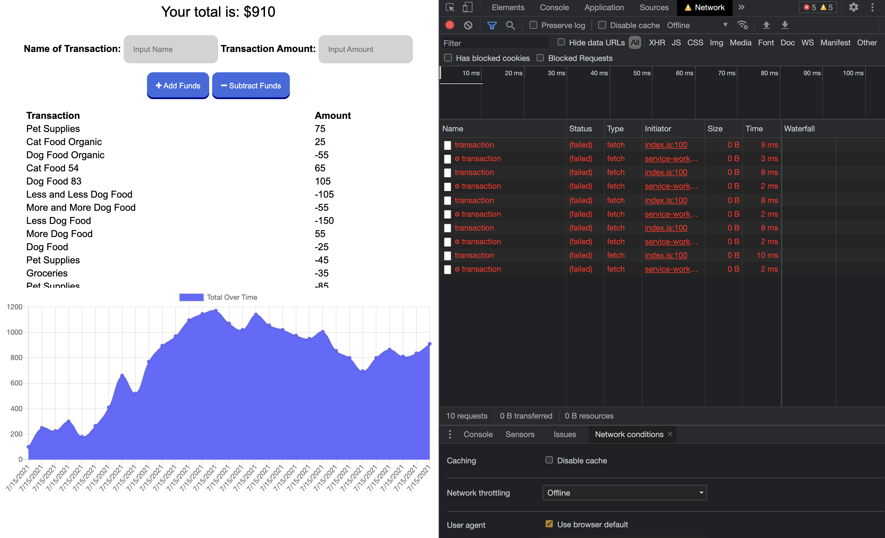

# Budget-Tracker

This budget tracker application allows users the functionality of adding or deducting expenses with or without an internet connection. As transactions are processed offline, the service worker allows for the population of tracked data as the application goes back live.

[Link to GitHub Repository](https://github.com/WitnessMyHands/Budget-Tracker)

[Link to Heroku Deployed Application](https://wmh-budget-tracker.herokuapp.com/)

## Table Of Contents

- [Description](#Description)
- [Installation](#Installation)
- [Gallery](#Gallery)
- [Questions](#Questions)

## Description

This application uses the following technologies:
* HTML
* CSS + Bootstrap
* Javascript
* Node.js
* MongoDB

## Installation

Use the following steps to run the application from your local storage:
* First clone the Repository:
```terminal
git clone git@github.com:WitnessMyHands/Budget-Tracker.git
```

* Choose the proper directory:
``` terminal
cd (local folder)
```

* Install Your Package using: 
```terminal
npm init --y
``` 

* Run the Application using:
```terminal
npm start
```

* When the Application has been launched successfully, open the Browser to navigate to: 'localhost:3000'

## Gallery

- Offline Application Example

- Service Worker -- To clear the data, you can Unregister the Service Worker and/or Clear the Cache from the 'Application' tab.


## Questions
*Please contact WitnessMyHands via GitHub with any questions or concerns.*

- https://github.com/WitnessMyHands
